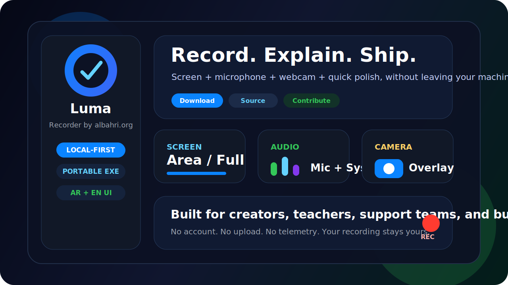
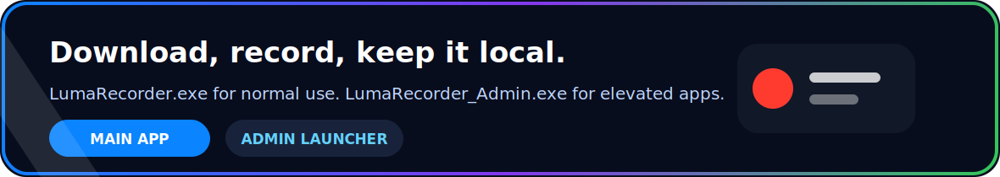

<div align="center">


[](#download)
[](#download)
[](#privacy)
[](#english--العربية)
[](#publisher)
[](LICENSE)


</div>



<div align="center">

### A beautiful portable Windows screen recorder for tutorials, demos, lessons, webcam narration, audio capture, Arabic/English UI, and local-first video polish.

**Official source only:**  
[github.com/albahri-org](https://github.com/albahri-org) · [github.com/QusaiALBahri](https://github.com/QusaiALBahri?tab=repositories)

</div>

---

## Publisher


Luma Recorder is published by **albahri.org**. The project files and Windows executable metadata identify the publisher and point back to the official source links above.

## English / العربية

<table>
  <tr>
    <td width="50%" valign="top">
      <h3>English</h3>
      <p><strong>Luma Recorder</strong> is a portable Windows screen recorder made for people who teach, explain, demonstrate, report issues, or save local visual notes.</p>
      <p>Record your screen, add microphone narration, capture system audio when Windows exposes a loopback device, show your webcam overlay, then keep the result locally in the recordings folder.</p>
      <p>It is built to feel fast: choose what to capture, press record, stop, polish if needed, and share the file your way.</p>
    </td>
    <td width="50%" valign="top" dir="rtl" align="right">
      <h3>العربية</h3>
      <p><strong>لوما ريكوردر</strong> هو مسجل شاشة محمول لنظام ويندوز، مناسب للشرح، الدروس، العروض، توثيق المشاكل، وتسجيل الملاحظات المرئية محليا.</p>
      <p>يمكنك تسجيل الشاشة، إضافة صوت الميكروفون، تسجيل صوت النظام عند توفر جهاز loopback، إظهار الكاميرا فوق التسجيل، ثم الاحتفاظ بالفيديو محليا داخل مجلد التسجيلات.</p>
      <p>صُمم ليكون سريع وواضح: اختر ما تريد تسجيله، اضغط تسجيل، أوقف التسجيل، عدّل إذا احتجت، ثم استخدم الملف بالطريقة التي تناسبك.</p>
    </td>
  </tr>
</table>

## Download



| File | Purpose |
| --- | --- |
| `LumaRecorder.exe` | Main portable recorder |
| `LumaRecorder_Admin.exe` | Opens the recorder with a visible Windows UAC prompt for elevated apps |
| `recordings/` | Default folder for saved videos |
| `TRUST_AND_SAFETY.txt` | Publisher, source, privacy, and safety notes |
| `Uninstall_LumaRecorder.cmd` | Removes the portable folder after confirmation |

```text
LumaRecorder.exe -> choose capture -> record -> stop -> recordings/
```

## The Experience


<table>
  <tr>
    <td align="center" width="25%"><h3>Choose</h3><p>Full screen or selected area.</p></td>
    <td align="center" width="25%"><h3>Explain</h3><p>Mic, webcam, and system audio where available.</p></td>
    <td align="center" width="25%"><h3>Polish</h3><p>Trim, compress, convert, snapshot, or zoom export.</p></td>
    <td align="center" width="25%"><h3>Keep</h3><p>Local recordings in your portable folder.</p></td>
  </tr>
</table>

## Feature Wall

<table>
  <tr>
    <td width="33%" valign="top">
      <h3>Capture</h3>
      <ul>
        <li>Full-screen recording</li>
        <li>Selected-area recording</li>
        <li>Cursor capture</li>
        <li>Countdown before recording</li>
        <li>Auto-stop timer</li>
      </ul>
    </td>
    <td width="33%" valign="top">
      <h3>Presenter Mode</h3>
      <ul>
        <li>Microphone narration</li>
        <li>Webcam overlay</li>
        <li>Floating control bar</li>
        <li>Pause and resume</li>
        <li>Global hotkeys</li>
      </ul>
    </td>
    <td width="33%" valign="top">
      <h3>Audio</h3>
      <ul>
        <li>Microphone recording</li>
        <li>System audio when loopback is available</li>
        <li>Audio extraction</li>
        <li>Useful for tutorials and support videos</li>
      </ul>
    </td>
  </tr>
  <tr>
    <td width="33%" valign="top">
      <h3>Quick Polish</h3>
      <ul>
        <li>Trim video</li>
        <li>Convert video</li>
        <li>Compress video</li>
        <li>Snapshot export</li>
        <li>Zoom/focus export</li>
      </ul>
    </td>
    <td width="33%" valign="top">
      <h3>Portable</h3>
      <ul>
        <li>No installer required</li>
        <li>Settings stay beside the app</li>
        <li>Recordings folder included</li>
        <li>Clean uninstall helper</li>
      </ul>
    </td>
    <td width="33%" valign="top">
      <h3>Trust</h3>
      <ul>
        <li>Publisher metadata: albahri.org</li>
        <li>Official source links included</li>
        <li>Privacy notes included</li>
        <li>Admin launcher is explicit and visible</li>
      </ul>
    </td>
  </tr>
</table>

## Quick Start / البدء السريع

<table>
  <tr>
    <td width="50%" valign="top">
      <h3>English</h3>
      <ol>
        <li>Open <code>LumaRecorder.exe</code>.</li>
        <li>Choose <strong>Full screen</strong> or <strong>Select area</strong>.</li>
        <li>Enable microphone if you want narration.</li>
        <li>Enable webcam overlay if you want presenter view.</li>
        <li>Press <strong>Record</strong>.</li>
        <li>Stop when finished.</li>
        <li>Open <code>recordings/</code>.</li>
      </ol>
    </td>
    <td width="50%" valign="top" dir="rtl" align="right">
      <h3>العربية</h3>
      <ol>
        <li>افتح <code>LumaRecorder.exe</code>.</li>
        <li>اختر <strong>الشاشة كاملة</strong> أو <strong>تحديد منطقة</strong>.</li>
        <li>فعّل الميكروفون إذا كنت تريد الشرح بالصوت.</li>
        <li>فعّل الكاميرا إذا كنت تريد ظهورك أثناء التسجيل.</li>
        <li>اضغط <strong>Record</strong>.</li>
        <li>أوقف التسجيل عند الانتهاء.</li>
        <li>افتح مجلد <code>recordings/</code>.</li>
      </ol>
    </td>
  </tr>
</table>

## Hotkeys

| Shortcut | Action |
| --- | --- |
| `Ctrl + Shift + R` | Start recording |
| `Ctrl + Shift + S` | Stop recording |
| `Ctrl + Shift + P` | Pause or resume |

## Privacy

Luma Recorder is built around a plain promise: the recording belongs to the user.

| Included | Not Included |
| --- | --- |
| Local recording | Account sign-in |
| Portable settings | Upload feature |
| Optional EFS encryption | Cloud sync |
| Clean uninstall helper | Telemetry |
| Admin launcher transparency | Background service |

The Privacy tab includes optional Windows EFS encryption for the recordings folder. EFS encrypts files for the current Windows user account. Availability depends on Windows edition, drive format, and system policy.

## Admin Launcher

Some Windows applications run with elevated permissions. A normal recorder may not capture those apps correctly.

Use:

```text
LumaRecorder_Admin.exe
```

Windows will show a standard UAC prompt, then open the recorder elevated.

Admin mode is not a bypass tool. It does not record Windows secure desktops, login screens, protected/DRM video, or operating-system privacy-protected surfaces.

## System Audio Notes

System audio recording depends on Windows exposing a loopback audio source. Depending on your audio driver, it may appear as:

- `Stereo Mix`
- `What U Hear`
- `Loopback`
- a virtual audio cable device

If no loopback device appears, microphone recording still works normally.

## Repository Layout

```text
.
├─ LumaRecorder.exe
├─ LumaRecorder_Admin.exe
├─ assets/
│  ├─ albahri-brand.svg
│  ├─ download-strip.svg
│  ├─ live-terminal.svg
│  ├─ luma-flow.svg
│  ├─ luma-hero.svg
│  └─ neon-dashboard.svg
├─ src/
│  ├─ luma_recorder.py
│  └─ admin_launcher.py
├─ packaging/
│  ├─ version_main.txt
│  └─ version_admin.txt
├─ recordings/
├─ build.ps1
├─ BUILDING.md
├─ SECURITY.md
├─ TRUST_AND_SAFETY.txt
├─ Uninstall_LumaRecorder.cmd
└─ LICENSE
```

## Build From Source

Requirements:

- Windows 10 or later
- Python
- PyInstaller
- FFmpeg available on `PATH`

Build:

```powershell
.\build.ps1
```

More details are in [BUILDING.md](BUILDING.md).

## Trust

Windows file details identify the publisher as **albahri.org** and include the official source links.

For public distribution at scale, sign release builds with a code-signing certificate issued to the publisher. Metadata helps people understand what they are running; code signing is the Windows standard for verified publisher identity.

## License

Released under the MIT License. See [LICENSE](LICENSE).
