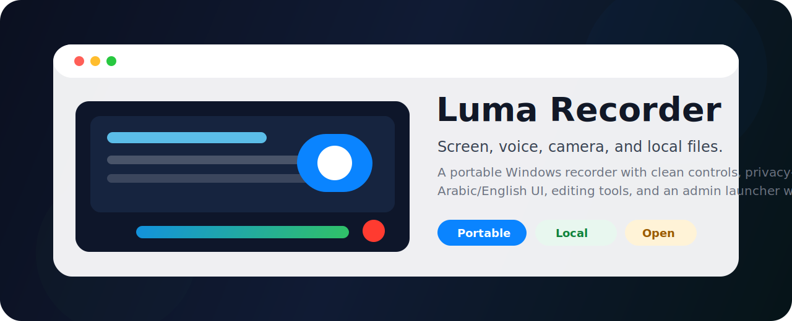
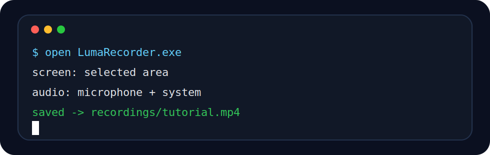
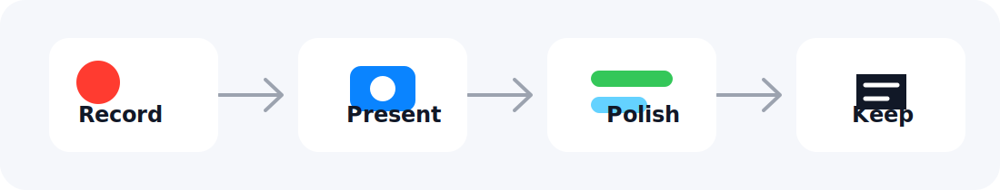

<div align="center">




<br/>


[](#download-and-run)
[](#download-and-run)
[](#privacy-first)
[](#arabic--english)
[](#publisher)
[](LICENSE)


**Record the screen. Explain with voice. Add camera. Keep the file.**

Official source only:

[github.com/albahri-org](https://github.com/albahri-org) · [github.com/QusaiALBahri](https://github.com/QusaiALBahri?tab=repositories)

</div>


---

## Publisher

<div align="center">


</div>

Luma Recorder is published by **albahri.org**. The project files and Windows executable metadata identify the publisher and point back to the official source links above.

## Why This Exists

Most recording tools make you choose between two bad feelings:

- tiny tools that cannot capture the full explanation
- heavy studio apps that slow you down before you even press record

Luma Recorder is the middle path: a portable recorder that starts quickly, captures what matters, and gives you enough editing tools to finish the job without turning the workflow into a production pipeline.

<div align="center">



</div>

## Repository At A Glance

<div align="center">

| Portable | Local | Bilingual | Presenter Ready |
| :---: | :---: | :---: | :---: |
| No installer | No telemetry | Arabic + English | Mic + webcam |
| Runs from folder | Files stay local | Easy language switch | Floating controls |

</div>

## Arabic / العربية

<table>
  <tr>
    <td width="50%" valign="top">
      <h3>English</h3>
      <p><strong>Luma Recorder</strong> is a portable Windows screen recorder made for people who teach, explain, demonstrate, report issues, or save local visual notes.</p>
      <p>You can record the screen, add microphone narration, include system audio when available, show your webcam overlay, then save the result locally in the recordings folder.</p>
      <p>The app is designed to feel direct: choose what to capture, press record, stop, and keep the video.</p>
    </td>
    <td width="50%" valign="top" dir="rtl" align="right">
      <h3>العربية</h3>
      <p><strong>لوما ريكوردر</strong> هو مسجل شاشة محمول لنظام ويندوز، مناسب للشرح، الدروس، العروض، توثيق المشاكل، وتسجيل الملاحظات المرئية محليا.</p>
      <p>يمكنك تسجيل الشاشة، إضافة صوت الميكروفون، تسجيل صوت النظام عند توفر جهاز loopback، إظهار الكاميرا فوق التسجيل، ثم حفظ الفيديو محليا داخل مجلد التسجيلات.</p>
      <p>الفكرة بسيطة وواضحة: اختر ما تريد تسجيله، اضغط تسجيل، أوقف التسجيل، واحتفظ بالملف عندك.</p>
    </td>
  </tr>
</table>

## The Flow



<table>
  <tr>
    <td width="25%" align="center"><strong>1. Choose</strong><br/>Full screen or selected area</td>
    <td width="25%" align="center"><strong>2. Explain</strong><br/>Mic, system audio, webcam</td>
    <td width="25%" align="center"><strong>3. Polish</strong><br/>Trim, compress, snapshot, zoom</td>
    <td width="25%" align="center"><strong>4. Keep</strong><br/>Local files, portable folder</td>
  </tr>
</table>

## Feature Cards

<table>
  <tr>
    <td width="33%" valign="top">
      <h3>Capture</h3>
      <ul>
        <li>Full screen recording</li>
        <li>Selected area recording</li>
        <li>Cursor capture</li>
        <li>Countdown before recording</li>
        <li>Auto-stop timer</li>
      </ul>
    </td>
    <td width="33%" valign="top">
      <h3>Sound + Camera</h3>
      <ul>
        <li>Microphone narration</li>
        <li>System audio when Windows exposes loopback</li>
        <li>Webcam overlay</li>
        <li>Floating control bar</li>
        <li>Pause and resume</li>
      </ul>
    </td>
    <td width="33%" valign="top">
      <h3>Finish</h3>
      <ul>
        <li>Trim video</li>
        <li>Convert video</li>
        <li>Compress video</li>
        <li>Extract audio</li>
        <li>Snapshot and zoom export</li>
      </ul>
    </td>
  </tr>
  <tr>
    <td width="33%" valign="top">
      <h3>Portable</h3>
      <ul>
        <li>No installer required</li>
        <li>Settings stay beside the app</li>
        <li>Recordings folder included</li>
        <li>Clean uninstall helper</li>
      </ul>
    </td>
    <td width="33%" valign="top">
      <h3>Private</h3>
      <ul>
        <li>No account</li>
        <li>No upload feature</li>
        <li>No telemetry</li>
        <li>Optional Windows EFS encryption</li>
      </ul>
    </td>
    <td width="33%" valign="top">
      <h3>Accessible</h3>
      <ul>
        <li>English interface</li>
        <li>Arabic interface</li>
        <li>Global hotkeys</li>
        <li>Admin launcher for elevated apps</li>
      </ul>
    </td>
  </tr>
</table>

## Download And Run

| File | Purpose |
| --- | --- |
| `LumaRecorder.exe` | Main portable recorder |
| `LumaRecorder_Admin.exe` | Opens the recorder with a visible Windows UAC prompt for elevated apps |
| `recordings/` | Default folder for saved videos |
| `TRUST_AND_SAFETY.txt` | Publisher, source, privacy, and safety notes |
| `Uninstall_LumaRecorder.cmd` | Removes the portable folder after confirmation |

```text
Open LumaRecorder.exe
Choose screen or area
Enable mic / system audio / webcam if needed
Record
Find your video in recordings/
```

## Quick Start / البدء السريع

<table>
  <tr>
    <td width="50%" valign="top">
      <h3>English</h3>
      <ol>
        <li>Open <code>LumaRecorder.exe</code>.</li>
        <li>Choose <strong>Full screen</strong> or <strong>Select area</strong>.</li>
        <li>Enable microphone if you want narration.</li>
        <li>Enable webcam overlay if you want presenter view.</li>
        <li>Press <strong>Record</strong>.</li>
        <li>Stop when finished.</li>
        <li>Open <code>recordings/</code>.</li>
      </ol>
    </td>
    <td width="50%" valign="top" dir="rtl" align="right">
      <h3>العربية</h3>
      <ol>
        <li>افتح <code>LumaRecorder.exe</code>.</li>
        <li>اختر <strong>الشاشة كاملة</strong> أو <strong>تحديد منطقة</strong>.</li>
        <li>فعّل الميكروفون إذا كنت تريد الشرح بالصوت.</li>
        <li>فعّل الكاميرا إذا كنت تريد ظهورك أثناء التسجيل.</li>
        <li>اضغط <strong>Record</strong>.</li>
        <li>أوقف التسجيل عند الانتهاء.</li>
        <li>افتح مجلد <code>recordings/</code>.</li>
      </ol>
    </td>
  </tr>
</table>

## Hotkeys

| Shortcut | Action |
| --- | --- |
| `Ctrl + Shift + R` | Start recording |
| `Ctrl + Shift + S` | Stop recording |
| `Ctrl + Shift + P` | Pause or resume |

## Privacy First

Luma Recorder is built around a plain promise: the recording belongs to the user.

| Included | Not Included |
| --- | --- |
| Local recording | Account sign-in |
| Portable settings | Upload feature |
| Optional EFS encryption | Cloud sync |
| Clean uninstall helper | Telemetry |
| Admin launcher transparency | Background service |

The Privacy tab includes optional Windows EFS encryption for the recordings folder. EFS encrypts files for the current Windows user account. Availability depends on Windows edition, drive format, and system policy.

## Admin Launcher

Some Windows applications run with elevated permissions. A normal recorder may not capture those apps correctly.

Use:

```text
LumaRecorder_Admin.exe
```

Windows will show a standard UAC prompt, then open the recorder elevated.

Admin mode is not a bypass tool. It does not record Windows secure desktops, login screens, protected/DRM video, or operating-system privacy-protected surfaces.

## System Audio Notes

System audio recording depends on Windows exposing a loopback audio source. Depending on your audio driver, it may appear as:

- `Stereo Mix`
- `What U Hear`
- `Loopback`
- a virtual audio cable device

If no loopback device appears, microphone recording still works normally.

## Repository Layout

```text
.
├─ LumaRecorder.exe
├─ LumaRecorder_Admin.exe
├─ assets/
│  ├─ albahri-brand.svg
│  ├─ live-terminal.svg
│  ├─ luma-hero.svg
│  └─ luma-flow.svg
├─ src/
│  ├─ luma_recorder.py
│  └─ admin_launcher.py
├─ packaging/
│  ├─ version_main.txt
│  └─ version_admin.txt
├─ recordings/
├─ build.ps1
├─ BUILDING.md
├─ SECURITY.md
├─ TRUST_AND_SAFETY.txt
├─ Uninstall_LumaRecorder.cmd
└─ LICENSE
```

## Build From Source

Requirements:

- Windows 10 or later
- Python
- PyInstaller
- FFmpeg available on `PATH`

Build:

```powershell
.\build.ps1
```

More details are in [BUILDING.md](BUILDING.md).

## Trust

Windows file details identify the publisher as **albahri.org** and include the official source links.

For public distribution at scale, sign release builds with a code-signing certificate issued to the publisher. Metadata helps people understand what they are running; code signing is the Windows standard for verified publisher identity.

## License

Released under the MIT License. See [LICENSE](LICENSE).
